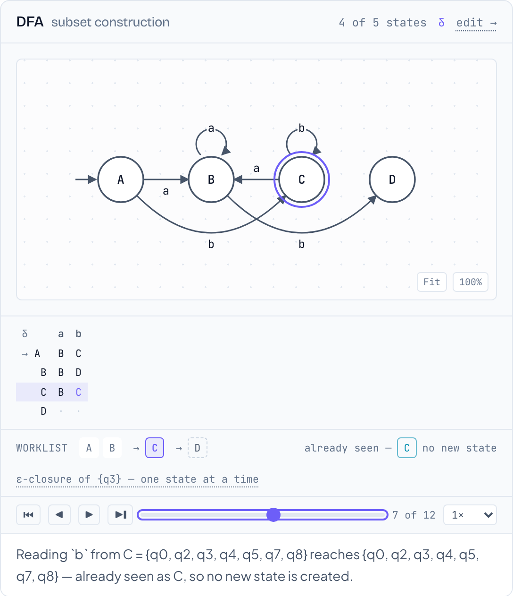
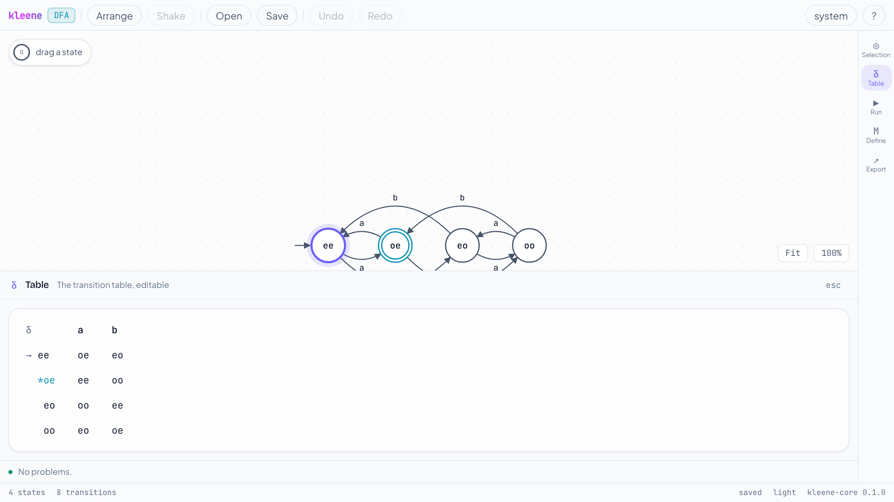

<div align="center">

# Kleene

**A browser-native automata theory workbench.**

Draw an automaton. Type a regular expression. Watch the conversion happen —
one subset-construction round at a time, with the reasoning attached to every step.

**[kleene.pranavmshukla.in](https://kleene.pranavmshukla.in)** · [Roadmap](docs/ROADMAP.md) · [Build plan](docs/plan/README.md) · [Contributing](CONTRIBUTING.md)

</div>

---

## Status

**Phases 0 through 4 are complete, and Phase 5 is finishing.** The pipeline closes on itself:

```
regex → ε-NFA → DFA → minimal DFA → regex
```

The editor draws and edits machines, the conversions run step by step on screen, and every
step carries the sentence that explains it. The property suite passes at 10,000 cases, and a
differential suite checks the whole thing against Rust's `regex` crate.

<p align="center">
  
</p>

That is the subset construction stopped partway. Four of the five states exist, δ is filled in
as far as it has been worked out, the worklist shows what is still waiting, and the sentence
underneath says what the round just did and why. Every one of those sentences was written in
Rust, beside the line of the algorithm that produced it.

<p align="center">
  
</p>

See the [phase plans](docs/plan/README.md) for what is being built and in what order,
[DECISIONS.md](docs/plan/DECISIONS.md) for the open questions, and
[LEFTOVERS.md](LEFTOVERS.md) for work deferred out of a phase.

## What it is

Every CS department teaches formal languages, and nearly all of them point students
at JFLAP — a Java desktop app that needs a JRE, cannot share anything with a link,
and shows you results without showing you reasoning.

Kleene is the same subject, rebuilt around one idea: **every algorithm returns its
reasoning alongside its result.**

```rust
pub struct Traced<T> {
    pub result: T,
    pub steps: Vec<Step>,
}
```

`determinize()` does not return a DFA. It returns a DFA _and_ the ordered list of
subset-construction rounds that produced it. The web UI renders `steps[i]` behind a
scrubber, the CLI prints them in verbose mode, and the docs generate examples from
them — one source of truth, three front ends.

## What it does

|                 |                                                                      |
| --------------- | -------------------------------------------------------------------- |
| **Editor**      | SVG canvas, drag states, draw transitions, undo/redo, auto-layout    |
| **Conversions** | regex → ε-NFA → DFA → minimal DFA → regex, each step-through-able    |
| **Simulation**  | Run a string, watch the configuration set move                       |
| **Export**      | TikZ, SVG, PNG, Graphviz DOT                                         |
| **Share**       | The whole automaton in a URL fragment — no account, no server        |
| **Import**      | `.jff` files, so JFLAP users and course materials work on day one    |
| **Offline**     | Installable PWA, working with the network switched off               |
| **CLI**         | `kleene equiv student.kln reference.kln` — autograde 200 submissions |

Still to come in v1: a Tauri desktop build. Explicitly **not** in v1: pushdown automata,
Turing machines, grammars, accounts, collaborative editing.

## Repository layout

```
crates/kleene-core/   pure algorithms, zero I/O, zero pixels
crates/kleene-wasm/   thin wasm-bindgen wrapper
crates/kleene-cli/    clap binary
web/                  Vite + React + TypeScript
docs/                 roadmap, phase plans, format specs
```

## Development

Requires a Rust toolchain (pinned by `rust-toolchain.toml`), Node 24, and
[`wasm-pack`](https://rustwasm.github.io/wasm-pack/) **v0.15.x** — the version matters,
because it supplies its own `binaryen` and the `wasm-opt` flags in
`crates/kleene-wasm/Cargo.toml` are only valid for the one it ships.

```sh
cargo test --workspace           # core algorithms + property suite at 256 cases

cd web
npm install
npm run dev                      # builds the wasm bundle, then serves the app
```

One command runs everything CI runs, in the order CI runs it:

```sh
./scripts/check.sh
```

The property and differential suites at the full 10,000 cases, as CI runs them nightly:

```sh
PROPTEST_CASES=10000 cargo test --release -p kleene-core --test properties
PROPTEST_CASES=10000 cargo test --release -p kleene-core --test differential
```

[CONTRIBUTING.md](CONTRIBUTING.md) has the rest — in particular the four architectural rules
a patch is expected not to break.

### The CLI

```sh
cargo run -p kleene-cli -- convert "(a+b)*abb" --to regex
cargo run -p kleene-cli -- minimize "(a+b)*abb" --verbose
cargo run -p kleene-cli -- equiv reference.kln submission.kln
```

`equiv` exits 0 when two machines agree and 1 when they do not, so it can drive a grading
script — and on disagreement it names the shortest string they differ on:

```
not equivalent
  `baabb` is in reference.kln, but student-02.kln rejects it.
```

## Contributing

[CONTRIBUTING.md](CONTRIBUTING.md) covers the build, the checks, and the four rules that hold
the design together. Bug reports are most useful as a share link — the button is in the
editor, and it puts the whole machine in the URL.

Security issues go through [SECURITY.md](SECURITY.md) rather than the public tracker.

## License

Dual-licensed under [MIT](LICENSE-MIT) or [Apache-2.0](LICENSE-APACHE), at your option — the
Rust ecosystem's convention. Contributions are accepted under the same terms.
